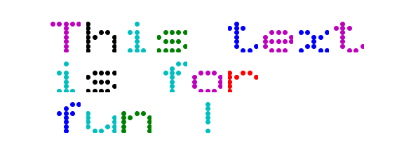
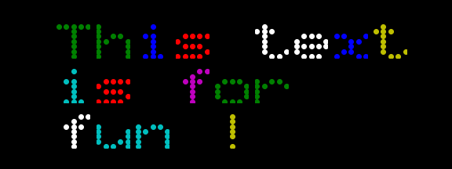
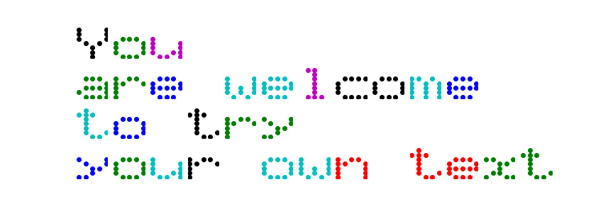
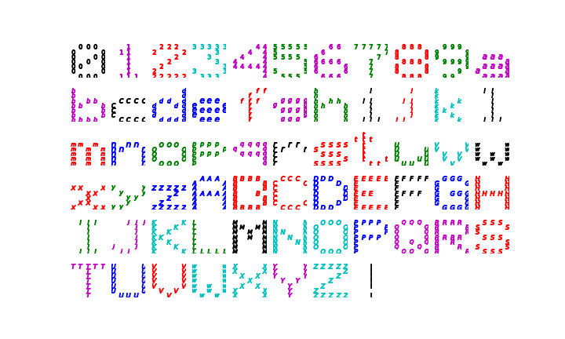
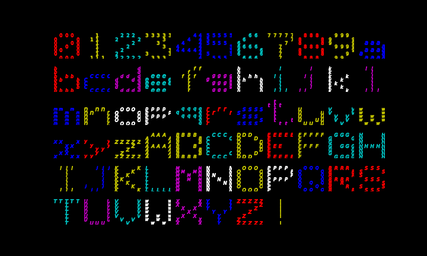

# Alphabet uses matplothlib to draw a custom message in a 5x7 dot matrix

The user can enter upto three lines of text and the result will be matplotlib figure with the text printed in a 5x7 led-like dot-matrix (like the ones used to disply messages on the streets).

## Examples

|||
|---|---|
|||
|||
|||
|||

## How it works:
- Enter the text you want to display inside single quotes:   
    - text = ['`You`', '`are welcome`', '`to try`', '`your own text`']
    - Text between each pair of single quotes represents a line
    - Each character is represented in one subplot
    - The amount of words/lines is limited based on matplotlib capabilities or the system running it.

## The logic behind:
- python 3.7 string.printable contains 100 characters:
    - \'0123456789abcdefghijklmnopqrstuvwxyzABCDEFGHIJKLMNOPQRSTUVWXYZ!"#$%&\'()*+,-./:;<=>?@[\\]^_`{|}~ \t\n\r\x0b\x0c'
- the last few characters are not visible when printed on my display:
    - space	' '	[index 94]
    - tab	'\t'
    - linefeed	'\n'
    - return	'\r'
    - formfeed	'\x0b'
    - vertical tab	'\x0c'	[index 99]
    - These will print an empty plot
- a dataframe is loaded with the pre-defined (x, y) coordinates for each one of the charaters.
    - how these coordinates where built can be seen in the excel file on this repository.
- loading a list of values into pandas is achieved by adding a ';' betweent the `x` and `y` values and using it as separator when reading the file
- The `x` and `y` columns need to be converted to list using `literal_eval` otherwise these will be considered as strings when loaded from csv. `converters={'x' : eval, 'y' : eval}`
- A figure with dimensions rows * columns (text_lines * longest_text_line) is created
- The text is scanned line by line, char by char and `string.printable` is used to find the index for that character.
- The index from `string.printable` is the same as the index in the DataFrame.   Using this index the (x, y) coordinates are located in the DataFrame and made available to be plot. 
- Using matplotlib the charater is plotted on it's repective space. 

**Note: the color for each character is random based on the `colors` list.  Intentionally the white 'w` and yellow `y` are removed from the random selection `random.randint(0, len(colors)-3)` as these are hard to see when the background is white.**

- If you want to use a single color for all the characters, you can remove the `#` on this line `#font_color = 'k'` and set your favorite color

- Want to save the text to a file? remove the `#` from the line `#plt.savefig`
- Want to customize the markers... see [matplotlib.markers](https://matplotlib.org/3.1.1/api/markers_api.html?highlight=matplotlib%20markers#module-matplotlib.markers) and the last cells for an example

- There are some custom "figures" loaded in the dataframe index 100+ these cannot be indexed by `string.printable`, are here to play with.   see last cells on this book

